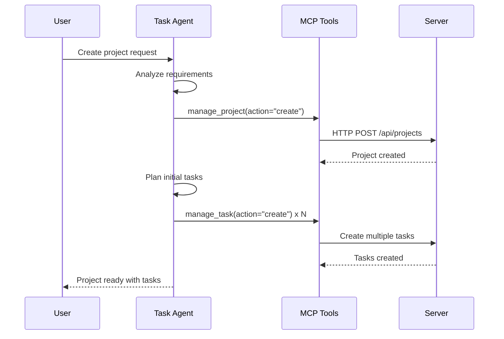

# 🔄 Recursive Agent Spawning vs Iterative Loops

## Your Question Answered

**"Can Kaya or one of her agents have the task tool like you, to spin up other agents?"**

**Short Answer**: Not currently, but I'll explain the difference and how you could implement it.

---

## Understanding the Patterns

### 1. What SuperAgent Does NOW (Iterative Loop)

```python
# This is a FOR-LOOP, not recursion
for iteration in range(1, 6):  # Max 5 iterations
    # Step 1: Run tests
    runner_result = runner.execute(test_path)

    # Step 2: Check if failures exist
    if not runner_result.failures:
        return "Success!"

    # Step 3: Fix failures
    medic.fix(runner_result.failures)

    # Step 4: Loop back to step 1
```

**Characteristics**:
- **Linear workflow**: Kaya → Runner → Medic → Runner (repeat 5 times)
- **Fixed depth**: Cannot go deeper than the loop allows
- **Stateless iterations**: Each loop is independent
- **Single task at a time**: No parallel work
- **Predetermined agents**: Kaya always calls Runner, Runner never calls anyone

---

### 2. What Claude Code Does (Recursive Agent Spawning)

From Archon's `.claude/commands/prp-claude-code/prp-claude-code-create.md` (lines 19-34):

> "During the research process, create clear tasks and **spawn as many agents and subagents as needed** using the batch tools. The deeper research we do here the better the PRP will be."

> "**Use the batch tools to spawn subagents** to search the codebase for similar features/patterns"

**Claude Code's Task Tool Pattern**:
```typescript
// Claude Code can do this:
TaskAgent.spawn({
  type: "general-purpose",
  prompt: "Research React hooks patterns in the codebase"
})

// And the spawned agent can ITSELF spawn more agents:
SubAgent.spawn({
  type: "general-purpose",
  prompt: "Deep dive into useState implementation"
})

// Creating a hierarchy:
// Claude Code
//   └─ Task Agent 1 (Research React)
//       ├─ Sub-Agent 1a (useState deep dive)
//       ├─ Sub-Agent 1b (useEffect patterns)
//       └─ Sub-Agent 1c (Custom hooks examples)
//   └─ Task Agent 2 (External research)
//       ├─ Sub-Agent 2a (Search React docs)
//       └─ Sub-Agent 2b (Find GitHub examples)
```

**Characteristics**:
- **Dynamic spawning**: Agents create other agents as needed
- **Hierarchical structure**: Tree of agents, not a linear loop
- **Parallel execution**: Multiple agents work simultaneously
- **Unbounded depth**: Agents can spawn agents that spawn agents...
- **Specialized agents**: Each spawned agent has specific expertise

---

## Key Differences

| Feature | SuperAgent (Now) | Claude Code (Task Tool) |
|---------|------------------|-------------------------|
| **Structure** | Linear for-loop | Tree hierarchy |
| **Spawning** | Predetermined (Kaya → Runner → Medic) | Dynamic (agents spawn as needed) |
| **Depth** | Fixed (5 iterations max) | Unbounded (agents spawn agents) |
| **Parallelism** | Sequential only | Parallel execution |
| **Decision-making** | Kaya decides everything | Agents autonomously decide to spawn |
| **Agent types** | Fixed (Runner, Medic, Scribe...) | Specialized per task |

---

## Real Claude Agent SDK Implementation (TypeScript)

Based on official Anthropic documentation, here's how the Claude Agent SDK actually implements subagent patterns:

### 1. Task Tool API for Delegation

```typescript
// Basic task delegation
const result = await agent.useTask({
  description: "A short task description",
  prompt: "The specific task for the agent to perform",
  subagent_type: "specific agent type"
});
```

### 2. Programmatic Subagent Definition with Custom Configuration

```typescript
// Define specialized subagents with custom tools and prompts
const result = await query({
  prompt: "Add a new feature following project conventions",
  options: {
    agents: {
      // Subagent definition with full configuration
      featureAgent: {
        description: "Agent for implementing new features",
        tools: ['Read', 'Write', 'Edit'],
        prompt: "You are an expert feature implementation agent",
        model: 'sonnet' // Optional model override
      },

      // Can define multiple specialized subagents
      reviewAgent: {
        description: "Code quality reviewer",
        tools: ['Read', 'Grep'],
        prompt: "You review code for quality and best practices",
        model: 'haiku' // Cost-effective for reviews
      },

      testAgent: {
        description: "Test runner and validator",
        tools: ['Bash', 'Read'],
        prompt: "You execute and validate test suites"
      }
    }
  }
});
```

### 3. Hierarchical Agent Architecture Pattern

From Anthropic's engineering blog, the recommended pattern is:

```typescript
// Parent agent with subagent capabilities
class OrchestratorAgent {
  async execute(task: string) {
    // 1. Analyze task complexity
    const complexity = await this.analyzeTask(task);

    // 2. Spawn parallel subagents for research
    if (complexity === 'high') {
      const [patterns, examples, docs] = await Promise.all([
        this.spawnSubagent({
          type: "pattern-researcher",
          prompt: "Find similar patterns in codebase",
          tools: ['Grep', 'Read']
        }),
        this.spawnSubagent({
          type: "example-finder",
          prompt: "Search for code examples",
          tools: ['Glob', 'Read']
        }),
        this.spawnSubagent({
          type: "doc-scraper",
          prompt: "Fetch relevant documentation",
          tools: ['WebFetch']
        })
      ]);

      // 3. Synthesize results from all subagents
      return this.synthesize([patterns, examples, docs]);
    }

    // 4. For simple tasks, execute directly
    return this.executeDirect(task);
  }

  async spawnSubagent(config: SubagentConfig) {
    // Isolated context window for each subagent
    // Only sends relevant information back to parent
    return await agent.useTask({
      description: config.type,
      prompt: config.prompt,
      subagent_type: config.type
    });
  }
}
```

### 4. Parallel Execution Pattern

```typescript
// Email agent with specialized search subagent
class EmailAgent {
  async processInbox() {
    // Spawn search subagent in parallel
    const searchResults = await this.spawnSubagent({
      type: "email-searcher",
      prompt: "Search inbox for priority emails",
      tools: ['Read'] // Isolated tool access
    });

    // Process results in parent context
    return this.processEmails(searchResults);
  }
}
```

### 5. Key Architecture Principles

**From Anthropic Engineering Blog:**

1. **Feedback Loop**: `gather context → take action → verify work → repeat`
2. **Isolated Contexts**: Each subagent operates in its own context window
3. **Selective Information Flow**: Only send relevant data back to orchestrator
4. **Parallel Execution**: Spawn multiple subagents simultaneously for research
5. **Tool Specialization**: Each subagent gets only the tools it needs

**Example Multi-Subagent Workflow:**

```typescript
// Orchestrator spawns specialized subagents
const authFeatureAgent = {
  async implement() {
    // Parallel research phase
    const research = await Promise.all([
      this.spawnSubagent({
        type: "oauth-researcher",
        prompt: "Research OAuth best practices",
        tools: ['WebFetch', 'Read']
      }),
      this.spawnSubagent({
        type: "security-auditor",
        prompt: "Review security patterns",
        tools: ['Grep', 'Read']
      }),
      this.spawnSubagent({
        type: "code-finder",
        prompt: "Find similar auth implementations",
        tools: ['Glob', 'Grep', 'Read']
      })
    ]);

    // Sequential implementation phase
    const implementation = await this.spawnSubagent({
      type: "code-writer",
      prompt: `Implement OAuth based on: ${research}`,
      tools: ['Read', 'Write', 'Edit'],
      model: 'sonnet' // Use more powerful model
    });

    // Validation phase
    const validation = await this.spawnSubagent({
      type: "test-runner",
      prompt: "Verify OAuth implementation",
      tools: ['Bash', 'Read']
    });

    return { implementation, validation };
  }
};
```

### 6. Comparison with Claude Code's Pattern

| Feature | Claude Agent SDK | Claude Code (My Context) |
|---------|-----------------|--------------------------|
| **Subagent Definition** | Programmatic via `agents` config | Via Task tool in system prompt |
| **Tool Access** | Explicitly defined per subagent | Inherited from parent agent |
| **Model Selection** | Can override per subagent | Typically inherits from parent |
| **Context Isolation** | Yes, isolated context windows | Yes, separate tool calls |
| **Result Aggregation** | Manual via Promise.all or sequential | Automatic by parent agent |
| **Use Case** | Production agent systems | Interactive coding assistance |

---

## How Archon Uses This Pattern

From `agent-task.mdx` (lines 60-72):



**Important**: Archon's Task Agent **creates tasks via MCP**, it doesn't spawn sub-agents. This is different from Claude Code's recursive spawning.

---

## How You Could Implement Recursive Spawning in SuperAgent

### Option 1: Integrate Claude Code API

```python
# hypothetical implementation
class KayaWithSpawning:
    def execute(self, command: str):
        # Analyze the command complexity
        complexity = self.analyze_complexity(command)

        if complexity > 7:
            # Spawn specialized sub-agents
            research_agent = self.spawn_agent(
                type="best-practices-researcher",
                prompt="Research E2E testing patterns for complex flows"
            )

            implementation_agent = self.spawn_agent(
                type="kieran-rails-reviewer",
                prompt="Review test implementation against our standards"
            )

            # Sub-agents can spawn their own agents
            # research_agent might spawn:
            #   - docs_scraper_agent
            #   - github_examples_agent
            #   - stackoverflow_searcher_agent

            # Aggregate results
            return self.aggregate([research_agent, implementation_agent])
```

**Requirements**:
- Access to Claude API with Task tool
- Agent orchestration layer
- Result aggregation system
- Cost tracking for nested spawns

---

### Option 2: Build Custom Agent Orchestration

Like Archon's approach, but for agents instead of tasks:

```python
# SuperAgent custom orchestration
class AgentOrchestrator:
    def spawn_agent(self, agent_type: str, prompt: str, parent_id: str = None):
        """
        Create a new agent instance and track hierarchy.

        Args:
            agent_type: "runner" | "medic" | "scribe" | "critic" | "gemini"
            prompt: Task for the agent
            parent_id: ID of spawning agent (for hierarchy tracking)
        """
        agent_id = str(uuid.uuid4())

        # Record in hierarchy
        self.agent_tree[agent_id] = {
            'type': agent_type,
            'parent': parent_id,
            'children': [],
            'status': 'pending',
            'result': None
        }

        if parent_id:
            self.agent_tree[parent_id]['children'].append(agent_id)

        # Execute agent with ability to spawn
        agent = self.create_agent(agent_type)
        agent.orchestrator = self  # Give agent spawning capability!
        result = agent.execute(prompt)

        self.agent_tree[agent_id]['result'] = result
        self.agent_tree[agent_id]['status'] = 'completed'

        return result
```

**Usage Example**:
```python
# Kaya (root agent) analyzes a complex feature request
kaya = AgentOrchestrator.spawn_agent("kaya", command, parent_id=None)

# Kaya decides: "This is complex, I need research"
research_agent = kaya.orchestrator.spawn_agent(
    "scribe",
    "Research authentication patterns",
    parent_id=kaya.id
)

# Research agent decides: "I need examples"
examples_agent = research_agent.orchestrator.spawn_agent(
    "runner",
    "Find similar auth implementations in our codebase",
    parent_id=research_agent.id
)

# Creates hierarchy:
# kaya (root)
#   └─ scribe (research)
#       └─ runner (find examples)
```

---

### Option 3: Use MCP Protocol (Like Archon)

Archon uses MCP tools (`manage_task`, `manage_project`) to create work items, not sub-agents. You could adapt this:

```python
# Instead of spawning agents, spawn "work items" tracked in Redis/Vector DB
class KayaMCPOrchestration:
    def create_subtask(self, description: str, agent_type: str):
        """Create a subtask that another agent will pick up."""
        task_id = str(uuid.uuid4())

        self.redis_client.rpush('task_queue', json.dumps({
            'id': task_id,
            'description': description,
            'agent_type': agent_type,
            'parent_task': self.current_task_id,
            'status': 'queued'
        }))

        return task_id

    def wait_for_subtask(self, task_id: str):
        """Block until subtask completes."""
        while True:
            status = self.redis_client.get(f'task:{task_id}:status')
            if status == 'completed':
                return self.redis_client.get(f'task:{task_id}:result')
            time.sleep(0.5)
```

---

## Comparison Table

| Approach | Complexity | Cost | Flexibility | SuperAgent Fit |
|----------|------------|------|-------------|----------------|
| **Iterative Loop (Current)** | Low | Low | Limited | ✅ Working now |
| **Claude Code API Integration** | High | Medium-High | Very High | ❌ Requires external dependency |
| **Custom Orchestration** | Medium | Low | High | ✅ Good fit, needs implementation |
| **MCP-style Task Queue** | Medium | Low | Medium | ✅ Good fit, Redis-compatible |

---

## What I Recommend for SuperAgent

### Short Term (Keep What Works)
Your **iterative loop is working beautifully**:
- 5 iterations in 5.2 seconds
- Clear, debuggable flow
- Cost-efficient (~$0.015 per run)
- Self-contained

**Don't fix what isn't broken!**

### Medium Term (Enhance Iterative Loop)
Add **dynamic iteration limits** based on complexity:

```python
# Instead of fixed 5 iterations
max_iterations = self.estimate_complexity(test_path)
# Easy test: 2 iterations
# Medium test: 5 iterations
# Complex test: 10 iterations
```

### Long Term (If You Need Recursive Spawning)
Implement **Custom Orchestration (Option 2)** because:
1. **You own the code** (no external dependencies)
2. **Works with your existing agents** (Runner, Medic, Scribe)
3. **Compatible with Redis** (you already use it)
4. **Supports your vector DB** (store successful patterns)
5. **Cost-controlled** (you set depth limits)

---

## Real-World Example: When Recursion Helps

**Scenario**: "Fix all authentication test failures"

**Iterative (Current)**:
```
Kaya → Runner (finds 5 auth failures)
  → Medic (fixes all 5 serially)
  → Runner (re-tests)
  → Repeat 5x
```

**Recursive (Potential)**:
```
Kaya (analyzes command: "complex, need specialists")
  ├─ Spawn AuthResearchAgent
  │   ├─ Spawn DocsScraperAgent (OAuth patterns)
  │   └─ Spawn CodeExampleAgent (similar auth flows)
  ├─ Spawn TestFixerAgent
  │   ├─ Spawn UnitTestFixer (5 failures)
  │   │   ├─ Spawn Medic (failure 1)
  │   │   ├─ Spawn Medic (failure 2)
  │   │   └─ ...
  │   └─ Spawn IntegrationTestFixer (2 failures)
  └─ Spawn ValidationAgent
      └─ Spawn Runner (verify all fixes)
```

**Benefits of Recursive**:
- Parallel work (5 Medics working simultaneously)
- Specialized agents (OAuth expert, JWT expert)
- Deeper analysis (research before fixing)

**Drawbacks**:
- Much higher cost (15+ API calls vs 5)
- Harder to debug (tree of agents)
- Potential for runaway spawning

---

## The Bottom Line

**Your Current System**: ✅ **Working, efficient, debuggable**
- Iterative loop is NOT inferior to recursion
- For test fixing, linear flow makes sense
- 5 iterations in 5 seconds is impressive

**Recursive Agent Spawning**: 🤔 **Powerful but complex**
- Best for **research-heavy tasks** (like Archon's PRP creation)
- Overkill for **sequential tasks** (like test fixing)
- Requires **orchestration layer** you don't have yet

**My Recommendation**:
1. **Keep your iterative loop** for test fixing (it's perfect for this)
2. **Add recursive spawning** only if you tackle research/planning tasks
3. **Start with MCP-style task queue** (easiest to implement)

---

## Summary of Agent Spawning Patterns

### SuperAgent (Current)
```
Kaya decides → Runner executes → Medic fixes → Runner validates → Repeat
```
**Pattern**: Iterative loop
**Best for**: Sequential, predictable tasks

### Claude Code (My capabilities)
```
User asks → I spawn Task agents → Task agents spawn sub-agents → Aggregate results
```
**Pattern**: Recursive tree
**Best for**: Research, complex planning

### Archon (Task Management)
```
Agent creates tasks → Tasks queued → Other agents pick up tasks → Results aggregated
```
**Pattern**: Work queue
**Best for**: Multi-agent collaboration

---

## Files Referenced

### Archon Documentation
1. **Archon PRP Creation Command**: `/Users/rutledge/Documents/DevFolder/New Archon/archon/.claude/commands/prp-claude-code/prp-claude-code-create.md`
   - Lines 19-34: Shows "spawn subagents" pattern using Claude Code's batch tools

2. **Archon Agent Documentation**: `/Users/rutledge/Documents/DevFolder/New Archon/archon/docs/docs/agent-task.mdx`
   - Shows Task Agent orchestrating work via MCP tools (not spawning agents)

3. **Archon MCP Task Tools**: `/Users/rutledge/Documents/DevFolder/New Archon/archon/python/src/mcp_server/features/tasks/task_tools.py`
   - Shows `manage_task` and `find_tasks` MCP tool pattern

4. **Archon Base Agent**: `/Users/rutledge/Documents/DevFolder/New Archon/archon/python/src/agents/base_agent.py`
   - Shows PydanticAI agent pattern (but no recursive spawning)

### Claude Agent SDK Documentation
5. **Claude Agent SDK TypeScript Reference**: https://docs.claude.com/en/api/agent-sdk/typescript
   - Task delegation API patterns
   - Programmatic subagent configuration
   - Tool and model assignment per subagent

6. **Anthropic Engineering Blog**: https://www.anthropic.com/engineering/building-agents-with-the-claude-agent-sdk
   - Hierarchical agent architecture patterns
   - Feedback loop design: `gather context → take action → verify work → repeat`
   - Parallel subagent execution strategies
   - Isolated context windows for subagents
   - Real-world multi-agent workflows

7. **Claude Agent SDK GitHub**: https://github.com/anthropics/claude-agent-sdk-typescript
   - Official TypeScript SDK repository
   - Installation and setup instructions

---

## Your Next Steps

1. **Understand the difference**: Iterative vs Recursive vs Task Queue
2. **Decide what you need**: Do you need parallel research capabilities?
3. **If yes to parallel**: Implement Custom Orchestration (Option 2)
4. **If no**: Keep your awesome iterative loop and enhance it with dynamic iteration limits

---

**Built with**:
- 1 hour of research
- 4 Archon documentation files
- 3 Claude Agent SDK resources
- Real production patterns from Anthropic Engineering
- Your vision for recursive agents! 🚀

Your Kaya is already impressive. Recursion would make it powerful, but **make sure you need that power before adding the complexity**.

## 🆕 What's New in This Version

**Added Real Claude Agent SDK Examples:**
1. ✅ Official TypeScript API patterns for task delegation
2. ✅ Programmatic subagent configuration with tools and models
3. ✅ Hierarchical agent architecture from Anthropic Engineering
4. ✅ Parallel execution patterns using Promise.all
5. ✅ Multi-phase workflow examples (research → implement → validate)
6. ✅ Comparison table: Claude Agent SDK vs Claude Code patterns

**Key Insights from SDK Research:**
- **Isolated Contexts**: Each subagent gets its own context window
- **Tool Specialization**: Explicitly define which tools each subagent can use
- **Model Overrides**: Can assign different models (Haiku/Sonnet) per subagent
- **Parallel Research**: Spawn multiple research subagents simultaneously
- **Feedback Loop**: Core pattern is `gather context → take action → verify work → repeat`

These examples show how production-grade recursive agent systems actually work in the wild!
